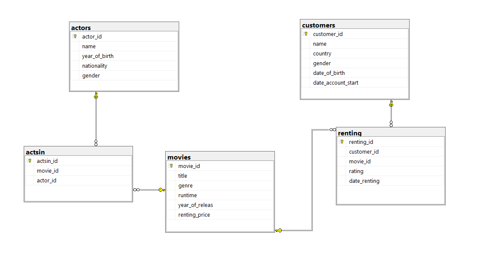
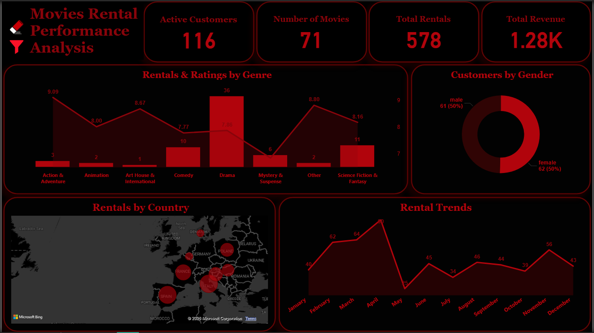

# 🎬 Movie Rental Business Analysis

This project analyzes a movie rental database using SQL to extract key business insights related to revenue, customers, and movie performance.

---
## 📂 Project Files

- SQL Queries:  
  [SQL File](Queries.sql)

- 📊 Power BI Dashboard File:  
  [Power BI File](movienow.pbix)

## Diagram

the database structure used in the analysis:

The database consists of Customers, Movies, Renting transactions and Actors.

---

## 📊 Overall Business Performance

- Total Revenue: **(1275.72)**
- Total Rentals: **(578)**
- Active Customers: **(116)**
- Number of Movies: **(71)**

This provides a snapshot of overall business activity and customer engagement.

---

##  Customer Growth Trend

- 2017 → 51 new customers  
- 2018 → 58 new customers (Peak Year)  
- 2019 → 14 new customers  

Customer acquisition increased from 2017 to 2018, then declined significantly in 2019.

This decline may indicate:
- Reduced customer acquisition rate
- Market saturation
- Change in customer behavior
- External factors affecting demand

Further data would be required to determine the exact cause.

---

## Performance by Country

Italy is the top-performing country in terms of:
- Highest rental activity
- Highest revenue contribution

This indicates that Italy represents the strongest and most profitable market.

---

##  Genre Performance Analysis

Key Insights:
- Drama is the dominant genre with the highest rentals (319) and total revenue (689.11).
- Niche genres such as "Other" and "Art House & International" have higher average rental prices.
- Revenue is mainly driven by volume rather than price.

---

##  Does Movie Length Impact Performance?

| Duration Category | Rentals | Avg Rating |
|-------------------|----------|------------|
| Medium (90–120 min) | 309 | 7 |
| Long (>120 min) | 269 | 8 |

Medium movies are rented more frequently but long movies receive higher ratings.

This suggests:
- Medium movies appeal to a broader audience.
- Longer movies may provide higher viewer satisfaction.

---

##  Monthly Revenue Trend

Revenue shows growth from 2017 to 2019.

Peak Months:
- February 2019 → 96.97
- March 2019 → 93.57

This indicates possible seasonal demand patterns.

---

## 📈 Interactive Dashboard

Power BI dashboard summarizing the key KPIs:

The dashboard includes:
- Revenue KPIs
- Country comparison
- Monthly revenue trends
- Genre performance analysis

---

## 📌 Final Conclusion

The business performance is primarily driven by:

- Strong performance in Italy
- High demand for Drama genre
- Higher rental volume in medium length movies
- Revenue peaks during early 2019
